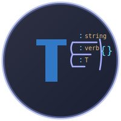

# 🔤 Typed Grammar

Typed Grammar creates TypeScript type-level libraries for expressing grammatically correct natural language. Our goal is to leverage TypeScript's powerful type system to help understand, learn, and verify the grammar rules of different languages.

## 🚀 Projects

- **[Typed Japanese](https://github.com/typedgrammar/typed-japanese)** - Our first prototype implements Japanese grammar as a TypeScript type system, enabling grammatically correct sentences to be annotated by TypeScript.
- **[Typed English](https://github.com/typedgrammar/typed-english)** - Currently in development, applying similar principles to English grammar.

## 🔮 Vision

We aim to create practical tools for language learners, educators, and developers by representing grammar rules through TypeScript's type system. These libraries can serve as:

- Educational tools for understanding grammar through code
- Intermediate formats for AI-assisted language learning
- Grammar verification systems
- Foundation for typed natural language tools

This is an early-stage initiative. We're focusing on building solid implementations for a few languages before expanding further.

## 📬 Contact

For collaborations, contributions, or inquiries, please reach out to `contact@typedgrammar.com`.
